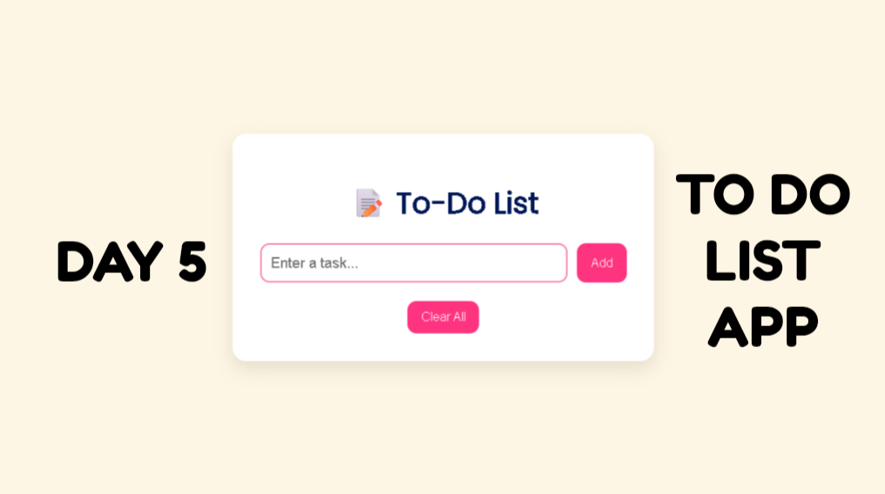

# 🚀 Day 5 - To-Do List App | 100 JavaScript Projects

## 📸 Preview

---

A simple, beautiful, and fully functional **To-Do List App** built using HTML, CSS, and JavaScript. It supports task creation, deletion, completion marking, and uses localStorage for saving tasks even after page reloads.

---

## ✨ Features

- ✅ Add new tasks
- 🗑️ Delete tasks individually
- ✔️ Mark tasks as completed
- 💾 Save tasks using localStorage
- 🎨 Fully responsive and beautifully styled
- 🧼 Clear All button to remove all tasks

---

## 🛠 Tech Stack

- HTML
- CSS
- JavaScript (Vanilla)

---

## 📹 Demo Video

[Watch Project Demo on YouTube](https://www.youtube.com/your-video-link-here)

---

## 🔗 Connect With Me

- [LinkedIn – Sneka Chandrasekaran](https://linkedin.com/in/sneka-chandrasekaran)
- [GitHub – snekaC2024](https://github.com/snekaC2024)

---

## 🔮 Next Project Preview

**Day 6 → BMI Calculator using JavaScript 💪**

Stay tuned!

---

## 📝 Made With ❤️ by Sneka Chandrasekaran
